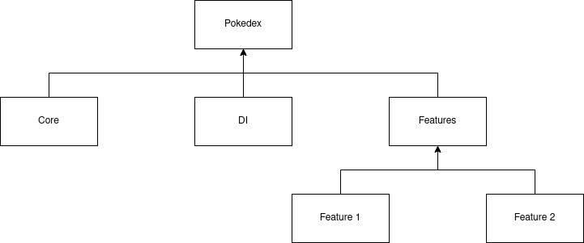
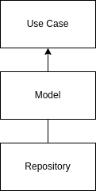
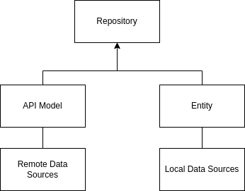
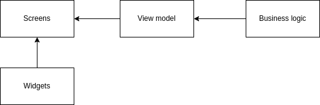

# Pokedex
Pokedex is a practice/portfolio project, which is used to practice new ways of working/new techniques, such as [Clean Architecture](https://blog.cleancoder.com/uncle-bob/2012/08/13/the-clean-architecture.html), MVVM, Jetpack Compose, Hilt, Room, (Unit) Testing etc.

The UI and documentation of this project was inspired by [Pokedex](https://github.com/skydoves/Pokedex). No code has been referenced while making this app.

# Tech stack / Libraries
- Minimum SDK level is 21 (Android 5.0).
- Written in [Kotlin](https://kotlinlang.org/).
- Architecture
  - Custom adaption of [Clean Architecture](https://blog.cleancoder.com/uncle-bob/2012/08/13/the-clean-architecture.html).
  - MVVM pattern
- [Coil](https://github.com/coil-kt/coil): Used to load images from URLs.
- [Compose Destinations](https://github.com/raamcosta/compose-destinations): Used for navigation within the Compose screens.
- [Compose Runtime LiveData](https://developer.android.com/jetpack/androidx/releases/compose-runtime): Used to support using a LiveData as a state.
- [Hilt](https://dagger.dev/hilt/): Used for dependency injection.
- [Jetpack Compose](https://developer.android.com/jetpack/compose): Android's modern toolkit for building Native UI.
- [JUnit 5](https://github.com/junit-team/junit5): Used for testing.
- [Kotest Assertions](https://github.com/kotest/kotest): Used for the assertions within the tests.
- [Material](https://github.com/material-components/material-components-android): Used for the color support
- [Mockk](https://github.com/mockk/mockk): Used for mocking within the tests.
- [Result](https://kotlinlang.org/api/latest/jvm/stdlib/kotlin/-result/): Used to make a function return an error or a model, can be used for error handling.
- [Retrofit](https://square.github.io/retrofit/): Used for the API calls.
- [Retrofit Gson Converter](https://github.com/square/retrofit/tree/master/retrofit-converters/gson): Used to convert Responses to kotlin data objects.
- [Room](https://developer.android.com/jetpack/androidx/releases/room): Used to locally save data after the initial start-up.
- [System UI Controller](https://github.com/google/accompanist/tree/main/systemuicontroller): Used to manually set the colors of the System UI bar.
- [Timber](https://github.com/JakeWharton/timber): Used for logging.

# Architecture
This project uses a feature-based folder structure:

The features use a custom adapation of the proposed [Clean Architecture](https://blog.cleancoder.com/uncle-bob/2012/08/13/the-clean-architecture.html). This structure implements a data, domain and presentation layer.

## Domain Layer
The domain layer is the innermost layer. This layer will contain only the core **business logic** (the use cases) and **business objects** (data models). It should be totally independent of every other layer. 

## Data layer
The data layer contains of the implementation of the repository (the contract comes from the domain layer) and data sources. The repository makes the decision regarding which data is returned, such as local or remote data.

## Presentation layer
The presentation layer holds everything which is used within the UI. This is also where the MVVM pattern comes into play. The presentation layer holds the widgets which are used within the UI, the separate screens and the view model. The viewmodel is used as an abstraction layer between the presentation and the business logic.

# API
Pokedex uses the [PokeAPI](https://pokeapi.co/) to gather it's data.

PokeAPI provides a RESTful API interface to highly detailed objects built from thousands of lines of data related to Pokemon.